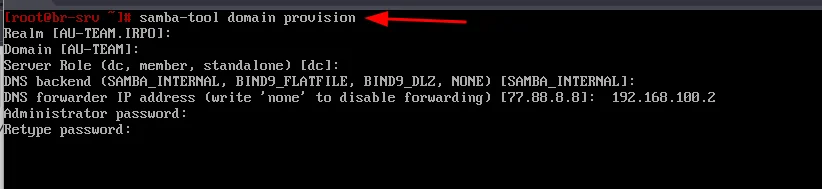
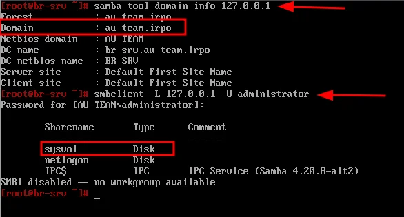
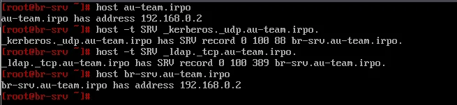
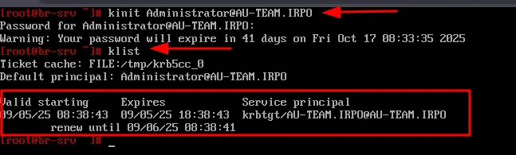
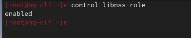
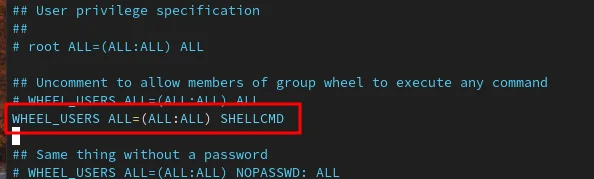

# Модуль 2. Задание 1: Настройка контроллера домена Samba DC

## Описание задания

- Имя домена: `au-team.irpo`
- Введите в созданный домен машину HQ-CLI
- Создайте 5 пользователей для офиса HQ: имена пользователей формата `hquser№` (например hquser1, hquser2 и т.д.)
- Создайте группу `hq`, введите в группу созданных пользователей
- Убедитесь, что пользователи группы `hq` имеют право аутентифицироваться на HQ-CLI
- Пользователи группы `hq` должны иметь возможность повышать привилегии для выполнения ограниченного набора команд: `cat`, `grep`, `id`. Запускать другие команды с повышенными привилегиями пользователи группы права не имеют.

---

## Решение

### Часть 1: Настройка Samba DC на BR-SRV

#### 1.1 Установка необходимых пакетов

```bash
apt-get update && apt-get install -y task-samba-dc
```

#### 1.2 Очистка предыдущей конфигурации Samba (если была)

```bash
rm -f /etc/samba/smb.conf
rm -rf /var/lib/samba
rm -rf /var/cache/samba
mkdir -p /var/lib/samba/sysvol
```

#### 1.3 Развёртывание домена

Запустите интерактивное развёртывание:

```bash
samba-tool domain provision
```

При запросе параметров:
- **Realm**: `AU-TEAM.IRPO` (подставится автоматически)
- **Domain**: `AU-TEAM` (подставится автоматически)
- **Server Role**: `dc` (нажмите Enter)
- **DNS backend**: `SAMBA_INTERNAL` (нажмите Enter)
- **DNS forwarder IP address**: `192.168.100.2` (IP HQ-SRV или другой DNS)
- **Administrator password**: введите пароль (минимум 7 символов, буквы верхнего/нижнего регистра, цифры)



Пример успешного вывода:


```
Server Role:            active directory domain controller
Hostname:               br-srv
NetBIOS Domain:         AU-TEAM
DNS Domain:             au-team.irpo
DOMAIN SID:             S-1-5-21-3779736722-240538183-1905
```

#### 1.4 Настройка служб

Включаем и добавляем в автозагрузку службу samba:

```bash
systemctl enable --now samba
```

Настройка Kerberos:

```bash
cp /var/lib/samba/private/krb5.conf /etc/krb5.conf
```

Перезагружаем службу samba:

```bash
systemctl restart samba
```

#### 1.5 Настройка DNS на BR-SRV

Редактируем resolv.conf для интерфейса:

```bash
echo "search au-team.irpo" > /etc/net/ifaces/ens192/resolv.conf
echo "nameserver 127.0.0.1" >> /etc/net/ifaces/ens192/resolv.conf
```

Перезагружаем сеть:

```bash
systemctl restart network
```

#### 1.6 Проверка работоспособности домена

Просмотр информации о домене:

```bash
samba-tool domain info 127.0.0.1
```

Проверка SMB-шар:

```bash
smbclient -L 127.0.0.1 -U administrator
```



Введите пароль администратора. Должны отобразиться шары `sysvol` и `netlogon`.

#### 1.7 Проверка DNS

Установка утилиты host (если не установлена):

```bash
apt-get install -y bind-utils
```

Проверка DNS-записей:

```bash
host au-team.irpo
host -t SRV _kerberos._udp.au-team.irpo
host -t SRV _ldap._tcp.au-team.irpo
host br-srv.au-team.irpo
```



#### 1.8 Проверка Kerberos

Получение билета (имя домена в ВЕРХНЕМ регистре):

```bash
kinit Administrator@AU-TEAM.IRPO
```

Просмотр полученного билета:

```bash
klist
```



---

### Часть 2: Создание пользователей и группы

#### 2.1 Создание группы hq

```bash
samba-tool group add hq
```


Проверка:

```bash
samba-tool group list
```


#### 2.2 Создание пользователей и добавление в группу

```bash
for i in {1..5}; do
  samba-tool user add hquser$i P@ssw0rd
  samba-tool user setexpiry hquser$i --noexpiry
  samba-tool group addmembers "hq" hquser$i
done
```

Проверка членства в группе:

```bash
samba-tool group listmembers hq
```

Ожидаемый вывод:
```
hquser1
hquser2
hquser3
hquser4
hquser5
```

---

### Часть 3: Ввод HQ-CLI в домен

#### 3.1 Настройка сети на HQ-CLI

Задаём статические параметры адресации с указанием DNS-сервера BR-SRV.

Через графический интерфейс (Настройки сети → Проводное подключение → IPv4):
- **Метод IPv4**: Вручную
- **Адрес**: `192.168.200.2`
- **Маска**: `24`
- **Шлюз**: `192.168.200.1`
- **DNS**: `192.168.0.2` (IP адрес BR-SRV)


Или через командную строку:

```bash
# В /etc/net/ifaces/<интерфейс>/resolv.conf
echo "search au-team.irpo" > /etc/net/ifaces/ens192/resolv.conf
echo "nameserver 192.168.0.2" >> /etc/net/ifaces/ens192/resolv.conf
systemctl restart network
```

Проверка разрешения доменного имени:

```bash
host au-team.irpo
```

#### 3.2 Установка пакетов для ввода в домен

```bash
apt-get update && apt-get install -y task-auth-ad-sssd
```

#### 3.3 Ввод в домен через Центр Управления Системой

1. Откройте **Центр управления системой**
2. Перейдите в раздел **Пользователи** → **Аутентификация**


3. Выберите **Active Directory**
4. Введите:
   - Домен: `au-team.irpo`
   - Имя компьютера: `hq-cli`
   - Администратор: `administrator`
   - Пароль: (пароль администратора домена)
5. Нажмите **Применить**

При успешном вводе появится сообщение:


#### 3.4 Перезагрузка HQ-CLI

После ввода в домен необходимо перезагрузить машину:


```bash
reboot
```

---

### Часть 4: Настройка ограниченного sudo для группы hq

#### 4.1 Установка libnss-role

```bash
apt-get install -y libnss-role
```

Проверка, что модуль включён:

```bash
control libnss-role
```



Ожидаемый вывод: `enabled`

#### 4.2 Связывание доменной группы с локальной группой wheel

```bash
roleadd hq wheel
```

Проверка:

```bash
rolelst
```


Ожидаемый вывод должен содержать строку:
```
hq:wheel
```

#### 4.3 Настройка sudoers

Редактируем файл `/etc/sudoers`:

```bash
visudo
```

или

```bash
nano /etc/sudoers
```

Добавляем алиас для разрешённых команд:


```sudoers
## Cmnd alias specification
Cmnd_Alias      SHELLCMD = /bin/cat, /bin/grep, /usr/bin/id
```

Добавляем правило для группы wheel:



```sudoers
## User privilege specification
WHEEL_USERS ALL=(ALL:ALL) SHELLCMD
```

> **Важно**: Убедитесь, что строка `WHEEL_USERS ALL=(ALL:ALL) ALL` закомментирована или удалена, чтобы пользователи группы wheel имели доступ только к указанным командам.

---

### Часть 5: Проверка работы

#### 5.1 Вход под доменным пользователем

На экране входа HQ-CLI нажмите **"Нет в списке?"**:


Введите:
- Логин: `hquser3` (или любой созданный пользователь)
- Пароль: `P@ssw0rd`

#### 5.2 Проверка разрешённых команд

```bash
sudo id
sudo cat /etc/hosts
sudo grep '127.0.0.1' /etc/hosts
```


Результат: все команды выполняются успешно.

#### 5.3 Проверка запрещённых команд

```bash
sudo su -
```


Результат: **отказано в доступе**
```
Извините, пользователю hquser3 не разрешено выполнять «/bin/su -» как root на hq-cli.au-team.irpo.
```

---

## Итоговая проверка

| Проверка | Команда | Ожидаемый результат |
|----------|---------|---------------------|
| Информация о домене | `samba-tool domain info 127.0.0.1` | Показывает Forest, Domain, DC name |
| Список групп | `samba-tool group list` | Содержит группу `hq` |
| Члены группы hq | `samba-tool group listmembers hq` | hquser1-5 |
| DNS домена | `host au-team.irpo` | Резолвится в IP BR-SRV |
| Kerberos | `kinit Administrator@AU-TEAM.IRPO && klist` | Билет получен |
| Вход на HQ-CLI | Вход под hquser1-5 | Успешная аутентификация |
| sudo id | `sudo id` | Выполняется |
| sudo cat | `sudo cat /etc/hosts` | Выполняется |
| sudo grep | `sudo grep '127' /etc/hosts` | Выполняется |
| sudo su | `sudo su -` | Отказано |

---

## Возможные проблемы и решения

### Ошибка при развёртывании домена
- Убедитесь, что пароль соответствует требованиям сложности
- Проверьте, что hostname настроен корректно

### HQ-CLI не видит домен
- Проверьте, что DNS указывает на BR-SRV
- Убедитесь в сетевой связности: `ping 192.168.0.2`

### Пользователь не может войти
- Проверьте службу sssd: `systemctl status sssd`
- Проверьте логи: `journalctl -u sssd`

### sudo не работает
- Проверьте синтаксис sudoers: `visudo -c`
- Убедитесь, что libnss-role включён: `control libnss-role`
