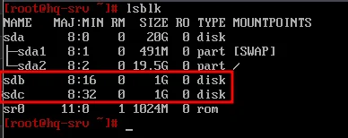
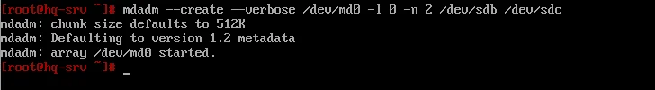
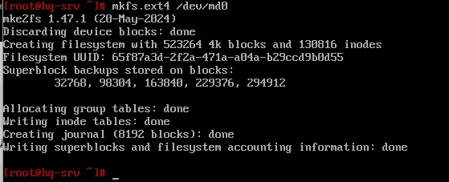
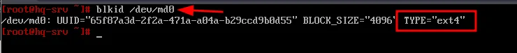
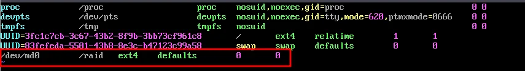
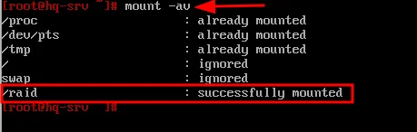
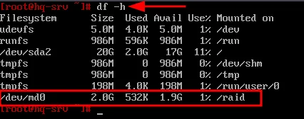

# Модуль 2. Задание 2: Конфигурация файлового хранилища (RAID)

## Описание задания

- При помощи двух подключенных к серверу дополнительных дисков размером 1 Гб сконфигурируйте дисковый массив уровня 0
- Имя устройства – `md0`, при необходимости конфигурация массива размещается в файле `/etc/mdadm.conf`
- Создайте раздел, отформатируйте раздел, в качестве файловой системы используйте `ext4`
- Обеспечьте автоматическое монтирование в папку `/raid`

---

## Решение

### Часть 1: Подготовка и установка

#### 1.1 Установка mdadm

`mdadm` — утилита для работы с программными RAID-массивами различных уровней.

```bash
apt-get update && apt-get install -y mdadm
```

#### 1.2 Определение дисков

Просматриваем физические диски для определения, какие будут использоваться в RAID-массиве:

```bash
lsblk
```



В данном примере для работы будут использованы диски: `sdb` и `sdc` (оба по 1 Гб).

> **Важно**: У вас диски могут называться иначе. Используйте команду `lsblk` для определения правильных имён.

---

### Часть 2: Создание RAID-массива

#### 2.1 Зануление суперблоков

Перед созданием массива необходимо занулить суперблоки на дисках:

```bash
mdadm --zero-superblock --force /dev/sdb /dev/sdc
```

> **Примечание**: Если диски новые и не использовались ранее в RAID, команда может выдать предупреждение — это нормально.

#### 2.2 Создание RAID-массива уровня 0

```bash
mdadm --create --verbose /dev/md0 -l 0 -n 2 /dev/sdb /dev/sdc
```

**Параметры команды:**
- `/dev/md0` — устройство RAID, которое появится после сборки
- `-l 0` — уровень RAID (0 = striping, чередование)
- `-n 2` — количество дисков в массиве
- `/dev/sdb /dev/sdc` — диски для сборки массива



#### 2.3 Сохранение конфигурации массива

Сохраняем конфигурацию в файл `/etc/mdadm.conf`:

```bash
mdadm --detail --scan --verbose | tee -a /etc/mdadm.conf
```

---

### Часть 3: Форматирование и монтирование

#### 3.1 Создание файловой системы

Форматируем массив в файловую систему ext4:

```bash
mkfs.ext4 /dev/md0
```



#### 3.2 Проверка UUID массива

```bash
blkid /dev/md0
```



Запомните UUID — он понадобится для fstab.

#### 3.3 Создание точки монтирования

```bash
mkdir /raid
```

#### 3.4 Настройка автоматического монтирования

Редактируем файл `/etc/fstab`:

```bash
nano /etc/fstab
```

Добавляем строку:

```
/dev/md0    /raid    ext4    defaults    0    0
```



> **Альтернативный вариант** (с использованием UUID):
> ```
> UUID=65f87a3d-2f2a-471a-a04a-b29ccd9b0d55    /raid    ext4    defaults    0    0
> ```

#### 3.5 Монтирование

Выполняем монтирование всех разделов из fstab:

```bash
mount -av
```



---

### Часть 4: Проверка

#### 4.1 Проверка смонтированных разделов

```bash
df -h
```



Должен отображаться `/dev/md0` размером ~2 Гб (сумма двух дисков при RAID 0), смонтированный в `/raid`.

#### 4.2 Проверка состояния RAID

```bash
cat /proc/mdstat
```

Или подробная информация:

```bash
mdadm --detail /dev/md0
```

---

## Итоговая проверка

| Проверка | Команда | Ожидаемый результат |
|----------|---------|---------------------|
| Диски в массиве | `lsblk` | sdb и sdc являются частью md0 |
| Состояние RAID | `cat /proc/mdstat` | md0 : active raid0 |
| Файловая система | `blkid /dev/md0` | TYPE="ext4" |
| Монтирование | `df -h \| grep raid` | /dev/md0 смонтирован в /raid |
| Автомонтирование | `cat /etc/fstab` | Строка с /dev/md0 и /raid |

---

## Дополнительная информация

### Уровни RAID

| Уровень | Описание | Минимум дисков | Ёмкость |
|---------|----------|----------------|---------|
| RAID 0 | Чередование (striping) | 2 | 100% (сумма дисков) |
| RAID 1 | Зеркалирование (mirroring) | 2 | 50% (размер одного диска) |
| RAID 5 | Чередование с распределённой чётностью | 3 | (N-1) × размер диска |

### Полезные команды

```bash
# Просмотр состояния всех массивов
cat /proc/mdstat

# Подробная информация о массиве
mdadm --detail /dev/md0

# Остановка массива
mdadm --stop /dev/md0

# Удаление массива
mdadm --remove /dev/md0
```

---

## Возможные проблемы и решения

### Диски не видны в lsblk
- Проверьте, что диски добавлены в виртуальной машине
- Перезагрузите систему после добавления дисков

### Ошибка при создании массива
- Убедитесь, что диски не используются (не смонтированы)
- Выполните зануление суперблоков

### Массив не монтируется автоматически
- Проверьте синтаксис в `/etc/fstab`
- Убедитесь, что директория `/raid` создана
- Проверьте: `mount -av` для диагностики
