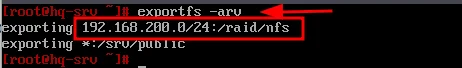
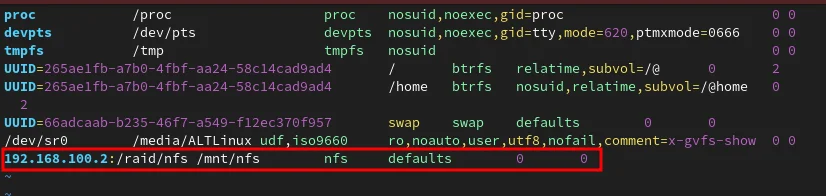
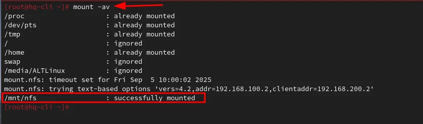
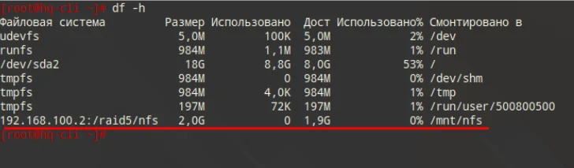
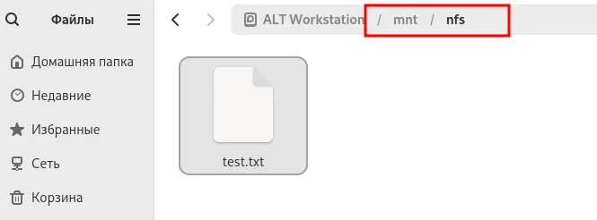
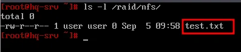

# Модуль 2. Задание 3: Настройка сервера сетевой файловой системы (NFS)

## Описание задания

- В качестве папки общего доступа выберите `/raid/nfs`, доступ для чтения и записи исключительно для сети в сторону HQ-CLI
- На HQ-CLI настройте автомонтирование в папку `/mnt/nfs`
- Основные параметры сервера отметьте в отчёте

---

## Решение

### Часть 1: Настройка NFS-сервера на HQ-SRV

#### 1.1 Установка пакетов

```bash
apt-get install -y nfs-server nfs-utils
```

#### 1.2 Создание директории общего доступа

Создаём директорию внутри RAID-массива:

```bash
mkdir /raid/nfs
```

#### 1.3 Назначение прав

```bash
chmod 777 /raid/nfs
```

#### 1.4 Настройка экспорта

Редактируем файл `/etc/exports`:

```bash
vim /etc/exports
```

Добавляем строку:

```
/raid/nfs    192.168.200.0/24(rw,no_root_squash)
```


**Параметры:**
- `/raid/nfs` — общий ресурс (директория для экспорта)
- `192.168.200.0/24` — клиентская сеть, которой разрешено монтирование
- `rw` — разрешены чтение и запись
- `no_root_squash` — отключение ограничения прав root (root на клиенте = root на сервере)

#### 1.5 Экспорт файловой системы

```bash
exportfs -arv
```



**Флаги команды:**
- `-a` — экспортировать все каталоги из `/etc/exports`
- `-r` — повторный экспорт всех каталогов (синхронизация)
- `-v` — подробный вывод

#### 1.6 Запуск и автозагрузка NFS-сервера

```bash
systemctl enable --now nfs-server
```

---

### Часть 2: Настройка NFS-клиента на HQ-CLI

#### 2.1 Установка пакетов

```bash
apt-get update && apt-get install -y nfs-utils nfs-clients
```

#### 2.2 Создание точки монтирования

```bash
mkdir /mnt/nfs
```

#### 2.3 Назначение прав

```bash
chmod 777 /mnt/nfs
```

#### 2.4 Настройка автомонтирования

Редактируем файл `/etc/fstab`:

```bash
vim /etc/fstab
```

Добавляем строку:

```
192.168.100.2:/raid/nfs    /mnt/nfs    nfs    defaults    0    0
```



> **Примечание**: `192.168.100.2` — IP-адрес сервера HQ-SRV. Замените на актуальный адрес в вашей сети.

#### 2.5 Монтирование

```bash
mount -av
```



---

### Часть 3: Проверка

#### 3.1 Проверка на клиенте (HQ-CLI)

```bash
df -h
```



Должна отображаться строка с `192.168.100.2:/raid/nfs`, смонтированная в `/mnt/nfs`.

#### 3.2 Проверка записи через файловый менеджер

На HQ-CLI откройте файловый менеджер и перейдите в `/mnt/nfs`. Создайте тестовый файл:



#### 3.3 Проверка на сервере (HQ-SRV)

```bash
ls -l /raid/nfs/
```



Файл `test.txt`, созданный на клиенте, должен отображаться на сервере.

---

## Итоговая проверка

| Проверка | Где | Команда | Ожидаемый результат |
|----------|-----|---------|---------------------|
| NFS-сервер работает | HQ-SRV | `systemctl status nfs-server` | active (running) |
| Экспорт настроен | HQ-SRV | `exportfs -v` | /raid/nfs с параметрами |
| Ресурс смонтирован | HQ-CLI | `df -h \| grep nfs` | 192.168.100.2:/raid/nfs |
| Запись работает | HQ-CLI | `touch /mnt/nfs/test` | Файл создаётся |
| Файл виден на сервере | HQ-SRV | `ls /raid/nfs/` | test виден |

---

## Основные параметры сервера (для отчёта)

| Параметр | Значение |
|----------|----------|
| Сервер | HQ-SRV (192.168.100.2) |
| Экспортируемая директория | /raid/nfs |
| Разрешённая сеть | 192.168.200.0/24 |
| Права доступа | rw (чтение и запись) |
| Root squash | отключён (no_root_squash) |
| Точка монтирования на клиенте | /mnt/nfs |
| Автомонтирование | через /etc/fstab |

---

## Дополнительные параметры exports

| Параметр | Описание |
|----------|----------|
| `rw` | Чтение и запись |
| `ro` | Только чтение |
| `sync` | Синхронная запись (безопаснее) |
| `async` | Асинхронная запись (быстрее) |
| `no_root_squash` | Root на клиенте = root на сервере |
| `root_squash` | Root на клиенте = nobody на сервере |
| `all_squash` | Все пользователи = nobody |
| `no_subtree_check` | Отключить проверку поддерева |

---

## Полезные команды

```bash
# Просмотр экспортированных ресурсов (на сервере)
exportfs -v

# Просмотр доступных ресурсов на сервере (с клиента)
showmount -e 192.168.100.2

# Принудительное размонтирование
umount -f /mnt/nfs

# Перезагрузка экспорта без перезапуска сервера
exportfs -ra
```

---

## Возможные проблемы и решения

### Ошибка "access denied" при монтировании
- Проверьте IP-адрес клиента в `/etc/exports`
- Убедитесь, что firewall не блокирует NFS (порты 111, 2049)

### Нет прав на запись
- Проверьте параметр `rw` в `/etc/exports`
- Проверьте права на директорию: `chmod 777 /raid/nfs`

### Ресурс не монтируется автоматически
- Проверьте синтаксис в `/etc/fstab`
- Добавьте опцию `_netdev` для сетевых ресурсов:
  ```
  192.168.100.2:/raid/nfs  /mnt/nfs  nfs  defaults,_netdev  0  0
  ```

### Таймаут при монтировании
- Проверьте сетевую связность: `ping 192.168.100.2`
- Убедитесь, что NFS-сервер запущен
