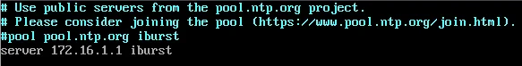
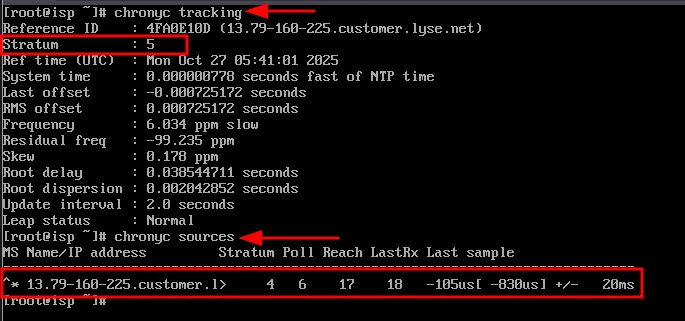
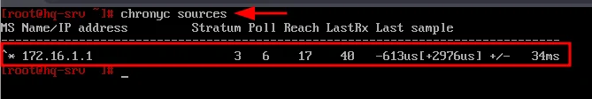
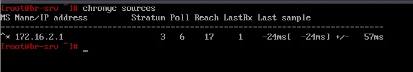

# Модуль 2. Задание 4: Настройка службы сетевого времени (Chrony)

## Описание задания

- Вышестоящий сервер NTP на маршрутизаторе ISP — на выбор участника
- Стратум сервера — 5
- В качестве клиентов NTP настройте: HQ-SRV, HQ-CLI, BR-RTR, BR-SRV

---

## Решение

### Часть 1: Настройка NTP-сервера на ISP

#### 1.1 Установка chrony (если не установлен)

```bash
apt-get install -y chrony
```

#### 1.2 Редактирование конфигурации

Редактируем файл `/etc/chrony.conf`:

```bash
vim /etc/chrony.conf
```

Добавляем/изменяем следующие строки:

```conf
# Вышестоящий NTP-сервер (на выбор)
pool pool.ntp.org iburst

# Установка стратума 5
local stratum 5

# Разрешаем синхронизацию для локальных сетей
allow 172.16.4.0/28
allow 172.16.5.0/28
```



**Параметры:**
- `pool pool.ntp.org iburst` — использование пула NTP-серверов
- `local stratum 5` — установка стратума сервера равным 5
- `allow` — разрешение синхронизации для указанных сетей

#### 1.3 Перезапуск службы

```bash
systemctl restart chronyd
systemctl enable chronyd
```

#### 1.4 Проверка работы NTP-сервера

```bash
chronyc tracking
chronyc sources
```



**Что проверяем:**
- `Stratum: 5` — стратум сервера
- В `chronyc sources` должен отображаться вышестоящий сервер с символом `*`

---

### Часть 2: Настройка NTP-клиентов

#### 2.1 Настройка HQ-RTR и BR-RTR

На маршрутизаторах редактируем `/etc/chrony.conf`:

```bash
vim /etc/chrony.conf
```

Закомментируем стандартные серверы и добавляем ISP:

```conf
# Закомментировать стандартный пул
#pool pool.ntp.org iburst

# Добавить ISP как NTP-сервер
server 172.16.4.1 iburst
```

> **Примечание**: Для BR-RTR используйте `server 172.16.5.1 iburst`

Перезапускаем службу:

```bash
systemctl restart chronyd
```

#### 2.2 Настройка HQ-SRV

Редактируем `/etc/chrony.conf`:

```bash
vim /etc/chrony.conf
```

```conf
#pool pool.ntp.org iburst
server 172.16.1.1 iburst
```

> **Примечание**: Используйте IP-адрес HQ-RTR или ISP, доступный из сети HQ-SRV

Перезапускаем:

```bash
systemctl restart chronyd
```

Проверяем:

```bash
chronyc sources
```



#### 2.3 Настройка HQ-CLI

Редактируем `/etc/chrony.conf`:

```bash
vim /etc/chrony.conf
```

```conf
#pool pool.ntp.org iburst
server 172.16.1.1 iburst
```

Перезапускаем:

```bash
systemctl restart chronyd
```

Проверяем:

```bash
chronyc sources
```


#### 2.4 Настройка BR-SRV

Аналогично HQ-SRV, редактируем `/etc/chrony.conf`:

```bash
vim /etc/chrony.conf
```

```conf
#pool pool.ntp.org iburst
server 172.16.2.1 iburst
```

> **Примечание**: Используйте IP-адрес BR-RTR или ISP, доступный из сети BR-SRV

Перезапускаем:

```bash
systemctl restart chronyd
```

Проверяем:

```bash
chronyc sources
```



---

## Итоговая проверка

| Устройство | Роль | NTP-сервер | Команда проверки |
|------------|------|------------|------------------|
| ISP | Сервер (stratum 5) | pool.ntp.org | `chronyc tracking` |
| HQ-RTR | Клиент | ISP (172.16.4.1) | `chronyc sources` |
| BR-RTR | Клиент | ISP (172.16.5.1) | `chronyc sources` |
| HQ-SRV | Клиент | HQ-RTR/ISP | `chronyc sources` |
| HQ-CLI | Клиент | HQ-RTR/ISP | `chronyc sources` |
| BR-SRV | Клиент | BR-RTR/ISP | `chronyc sources` |

### Ожидаемый результат `chronyc sources`

```
MS Name/IP address         Stratum Poll Reach LastRx Last sample
===============================================================================
^* 172.16.x.x                    5   6    17    40   -613us[+2976us] +/-   34ms
```

**Символы состояния:**
- `*` — текущий источник синхронизации
- `+` — приемлемый источник
- `-` — источник исключён алгоритмом
- `?` — источник потерял связь

---

## Основные параметры (для отчёта)

| Параметр | Значение |
|----------|----------|
| NTP-сервер | ISP |
| Стратум | 5 |
| Вышестоящий сервер | pool.ntp.org |
| Клиенты | HQ-RTR, BR-RTR, HQ-SRV, HQ-CLI, BR-SRV |
| Порт NTP | 123/UDP |

---

## Полезные команды chrony

```bash
# Статус синхронизации
chronyc tracking

# Список источников времени
chronyc sources

# Подробная информация об источниках
chronyc sourcestats

# Принудительная синхронизация
chronyc makestep

# Список клиентов (на сервере)
chronyc clients

# Проверка конфигурации
chronyd -p
```

---

## Возможные проблемы и решения

### Клиент не синхронизируется
- Проверьте сетевую связность: `ping 172.16.4.1`
- Убедитесь, что на сервере добавлена директива `allow` для сети клиента
- Проверьте firewall: порт 123/UDP должен быть открыт

### Stratum показывает 0 или 16
- Stratum 0 — источник времени (атомные часы, GPS)
- Stratum 16 — сервер не синхронизирован
- Подождите несколько минут после запуска службы

### Источник помечен символом `?`
- Сервер временно недоступен
- Проверьте сеть и статус службы на сервере

### Ошибка "No sources"
- Проверьте правильность IP-адреса в конфигурации
- Убедитесь, что служба chronyd запущена на сервере
